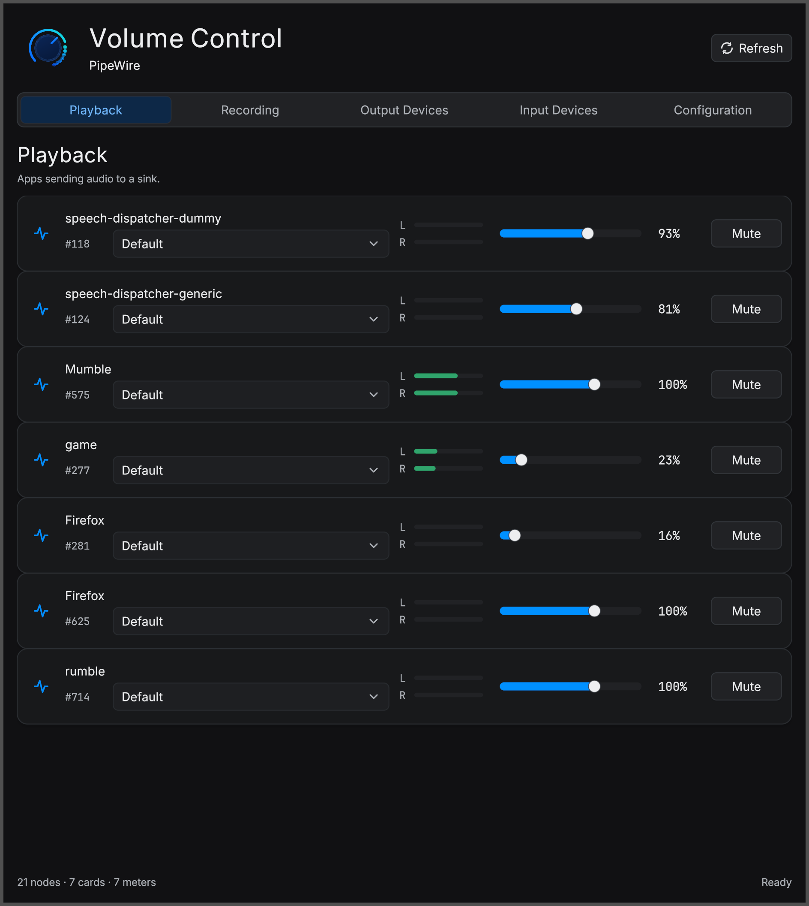

<h1>
  
  Aetna Volume
</h1>

A PipeWire volume control panel built with Aetna.

<p align="center">
  
</p>

The goal is to replace the day-to-day pavucontrol workflow with a native
PipeWire-first utility:

- playback streams
- recording streams
- output devices
- input devices
- card/profile/port configuration
- mute, volume, default-device, and stream-routing controls

This project intentionally starts as a separate consumer app rather than another
demo inside the Aetna repository. It should pressure-test Aetna against a real,
dense, always-useful desktop tool.

## Early Shape

The first milestone is read-only graph discovery plus a polished static control
surface. Mutating operations come after the object model is stable enough that
we can name PipeWire objects and routes correctly.

```bash
cargo run
```

Aetna is consumed from crates.io (currently `aetna-core`/`aetna-winit-wgpu` 0.3.1).

## Local install (Arch)

A minimal in-tree PKGBUILD is provided. From the repo root:

```bash
makepkg -si
```

This installs the `aetna-volume` binary, a hicolor scalable app icon
(`/usr/share/icons/hicolor/scalable/apps/aetna-volume.svg`), and a
`.desktop` entry that lands under `AudioVideo → Audio → Mixer` so the
launcher picks it up without a logout.

